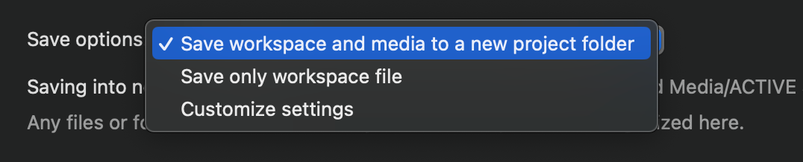

# Creating a Show File

---

:::info

Relevant official documentation found [here](https://qlab.app/docs/v5/fundamentals/managing-workspaces/)

:::

---


## Making a new Workspace

To make a new workspace in QLab, choose **New From Template** from the application's File menu. Or, use the keyboard shortcut <kbd>&#8984; N</kbd>.

Opening a new workspace will apply all YAT-specific settings. For more information on these, refer to the next part of the documentation.

## File Structure

<kbd>&#8679; &#8984; S</kbd> Will prompt you to save your show file to a location. To save the show appropriately, save it to the "<strong>Qlab Shows and Media</strong>" folder on the desktop. From there, choose the relevant organization folder - Past Shows, Non-Shows, or Active Shows - then, all you need to do is select "Save workspace and media to a new project folder," as seen below, and save. This save option will automatically sort your workspace into the file structure listed below, with separate audio and video folders.  

<br/><br/>

    


### File structure layout

```
- Mac Desktop -
├── Qlab Shows and Media
│   ├── Past Shows
│   ├── Non-Shows
│   ├── Active Shows
│	│	    ├── YOUR SHOW FOLDER
│   │		│		├── audio
│   │		│		│   ├── AUDIO + SFX FILES FOR SHOW
│   │		│		├── video
│   │		│		│   ├── PROJECTIONS AND VIDEOS FOR SHOW
└── settingsfile
```


## Setting up your show

Once settled, setting up the show is super easy! Drag and drop any audio or video cues straight onto the workspace to get started! We will cover how to utilize lighting cues [further on in this course](https://google.com) **<u>NEED TO ADD LINK HERE!!!</u>**.