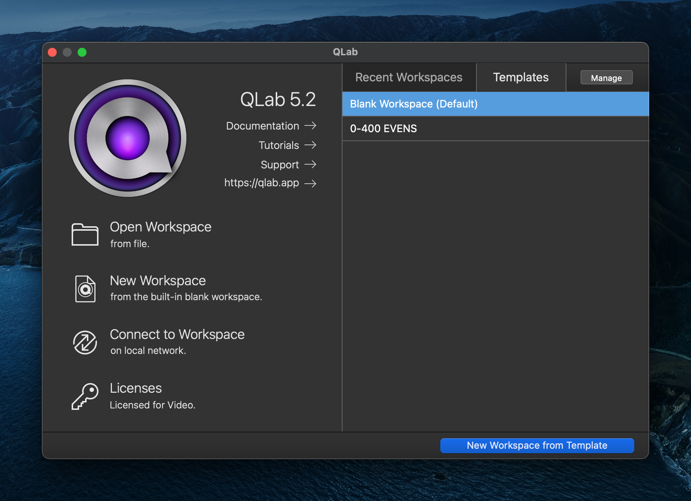

# Creating a Show File

---

:::info

Relevant official documentation found [here](https://qlab.app/docs/v5/fundamentals/workspace/)

:::

---

## Initializing a Workspace

To start a new workspace that already follows all of YAT's guidelines, quit and reopen QLab (if applicable) to bring you to the home screen. From there, Click "<u>0-400 EVENS</u>," or whatever template is relevant to your use case. 

This will in turn, open a new workspace, with preconfigured settings and lighting cues.
