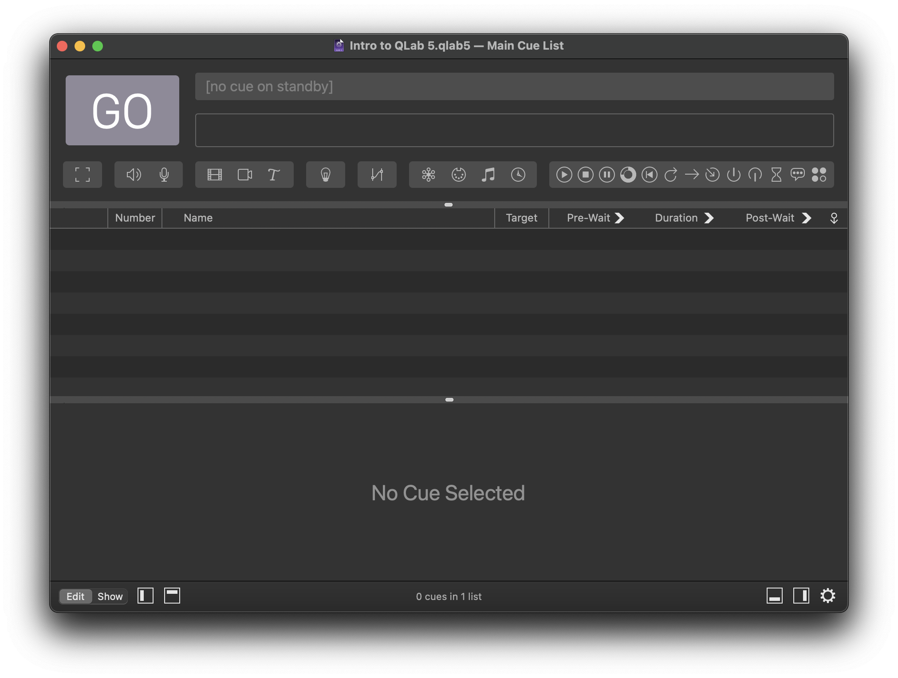
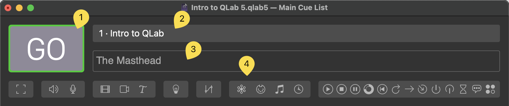
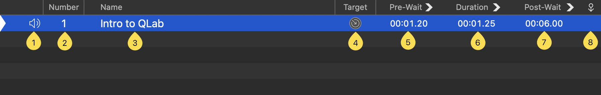
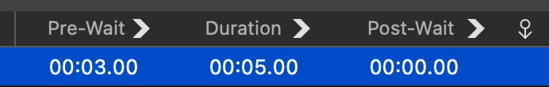

# QLab Fundamentals

---

:::info

Relevant official documentation found [here](https://qlab.app/docs/v5/fundamentals/)
:::

---

[TOC]

## The Workspace

A QLab document is called a **workspace**. Each workspace is the heart of the show, and contain one or more cue lists or carts, which each contain *cues.* Each workspace is unique to itself, meaning changes to settings and configuration will only affect your current workspace. An example of a blank QLab Workspace:

## The Masthead

The top part of the workspace is referred to as "The Masthead." The masthead displays four elements, the GO button 1, the standby display 2, the notes field 3, and the toolbar 4.
 

1. The GO button fires the selected cue. The same action as <kbd>Space</kbd> or pressing GO on the QWidget.
2. The standby display displays the currently selected cue.
3. The notes field is a rich text input field, and is searchable along with cue names by using <kbd>&#8984; F</kbd>.
4. The toolbar is a row of buttons for each type of cue available in QLab. This section will be covered when using Load To Time or the search function.

### The Cue List

The cue list populates in the middle section of the workspace. There is one row per cue, and multiple columns showing different information depending on the cue type. Most of these values can be edited by double clicking the cue, editing it in the inspector window, or using the respective keybind. Important sections will be covered in more detail below.

1. Type. This column shows a glyph representing the type of cue.
2. Number. The assigned cue number from the list, strictly for cosmetic and organization purposes <kbd>N</kbd>
3. Name. The assigned name to a cue, can be left blank, or filled in with the default QLab naming scheme. <kbd>Q</kbd>
4. Target. The target of the cue being fired, whether its a file or another cue.<kbd>T</kbd>
5. Pre-Wait. Delay which transpires before the cue starts. <kbd>E</kbd>
6. Duration. The length or time a cue will take to complete. <kbd>D</kbd>
7. Post-Wait. Meaningful only if the cue is set to auto-follow. The amount of time for QLab to wait to start the next cue when an auto-follow is triggered. <kbd>W</kbd>
8. Continue Mode. (see below) 

### Pre-Wait

Pre-wait is an optional delay that transpires before the cue starts. For example, when you start an Audio cue with a pre-wait of 3, that cue will allow three seconds to elapse, counting down its pre-wait, and then the audio will begin playing.

### Post-Wait

Post-Wait is meaningful only in combination with an "auto-continue," discussed below. If the first cue has a post-wait time, QLab waits for the post wait to finish before starting the next cue.

The post-wait of a cue can be edited by double clicking and typing in the post-wait column, or by using the keyboard shortcut for editing post-wait which is W by default.

The post-wait of a cue can be edited by double clicking and typing in the post-wait column, or by using the keyboard shortcut for editing post-wait which is W by default.

explaining what everything does on screen and how to use it (briefly how to use it)

- explain cues like how it is in the qlab docs
- explain timing and how we use it at yat (explain that timing is pre waits)
- use those epic gifs! love plagaraism

can explain the inspector + settings + group cues in settings file bc those all go over settings